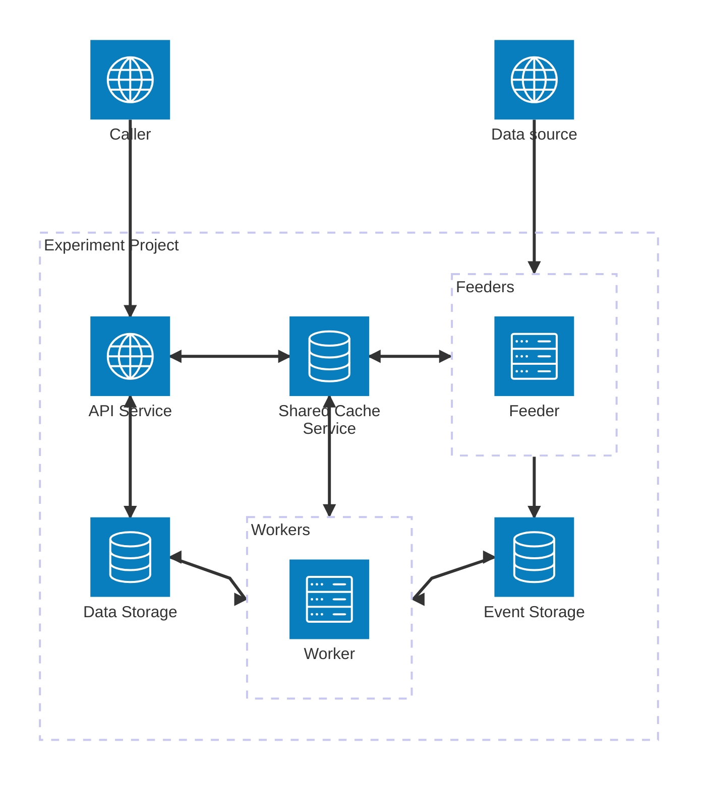

# Documents for *Experiment*

## Project Description
*Experiment* is a simple project built with a microservice architecture, designed for evaluating and practicing new programming languages and open-source libraries.

## Components

### Feeder
A proactive service that includes multiple crawlers, which collect and feed data into the event storage.

### API Service
Interfaces for viewing or modifying data, statistics, and settings. It also acts as a passive data receiver.

### Worker
Event-processing workers that process events from event storage to prevent blocking the Feeder or API Service.

### Event Storage
Stores all events and makes them easily accessible between microservices.

### Data Storage
Stores persistent data, such as snapshots.

### Shared Cache Service
A shared cache service that provides a consistent data source for read-heavy data.

## High-level Architecture Diagram

## Implementations

- **Feeder** - [**experiment-feeder-python**](experiment-feeder-python)

    Uses:
    - Python 3.12
    - [Pydantic](https://docs.pydantic.dev/) for data validation.
    - [APScheduler](https://github.com/agronholm/apscheduler) for task scheduling.
    - [confluent-kafka-python](https://github.com/confluentinc/confluent-kafka-python), Confluent's Python client, provides a high-level Producer and Consumer for Apache Kafka.
    - [polyfactory](https://github.com/litestar-org/polyfactory), a simple and powerful mock data generation library based on type hints and supporting dataclasses, typed-dicts, 

- **Worker** - [**experiment-worker-python**](https://github.com/maxswu/experiment-worker-python)

    Uses:
    - Python 3.12
    - [Pydantic](https://docs.pydantic.dev/) for data validation.
    - [faust-streaming](https://github.com/faust-streaming/faust) , a currently active community fork of the original [Faust](https://github.com/robinhood/faust)(by [Robinhood](https://robinhood.com/)).

- **API Service** - [**experiment-api-go**](https://github.com/maxswu/experiment-api-go)

    > Under construction
    
    Golang with [Gin](https://github.com/gin-gonic/gin) or [Fiber](https://github.com/gofiber/fiber) is planned for implementation.

- **Event Storage** - [Apache Kafka](https://kafka.apache.org/)

- **Data Storage** - [MongoDB](https://www.mongodb.com/)

- **Shared Cache Service** - [Redis](https://redis.io/)

## Features

### v1
- Fetch securities information from the TWSE (Taiwan Stock Exchange) API.
- Send notifications via Slack based on user-defined technical indicators.

### v2 (draft)
- An API Service for statistics.
- Real-time market data for TWSE.

### v3 (draft)
- Integration with ordering APIs for TWSE.

## What's next ?

- Implement the API Service in Golang using [Gin](https://github.com/gin-gonic/gin) or [Fiber](https://github.com/gofiber/fiber).
- Add more unit tests.
- Move stateless services to Kubernetes.
- Explore more high-concurrency use cases.
- Try other stream-processing frameworks such as [Apache Flink](https://flink.apache.org/).
